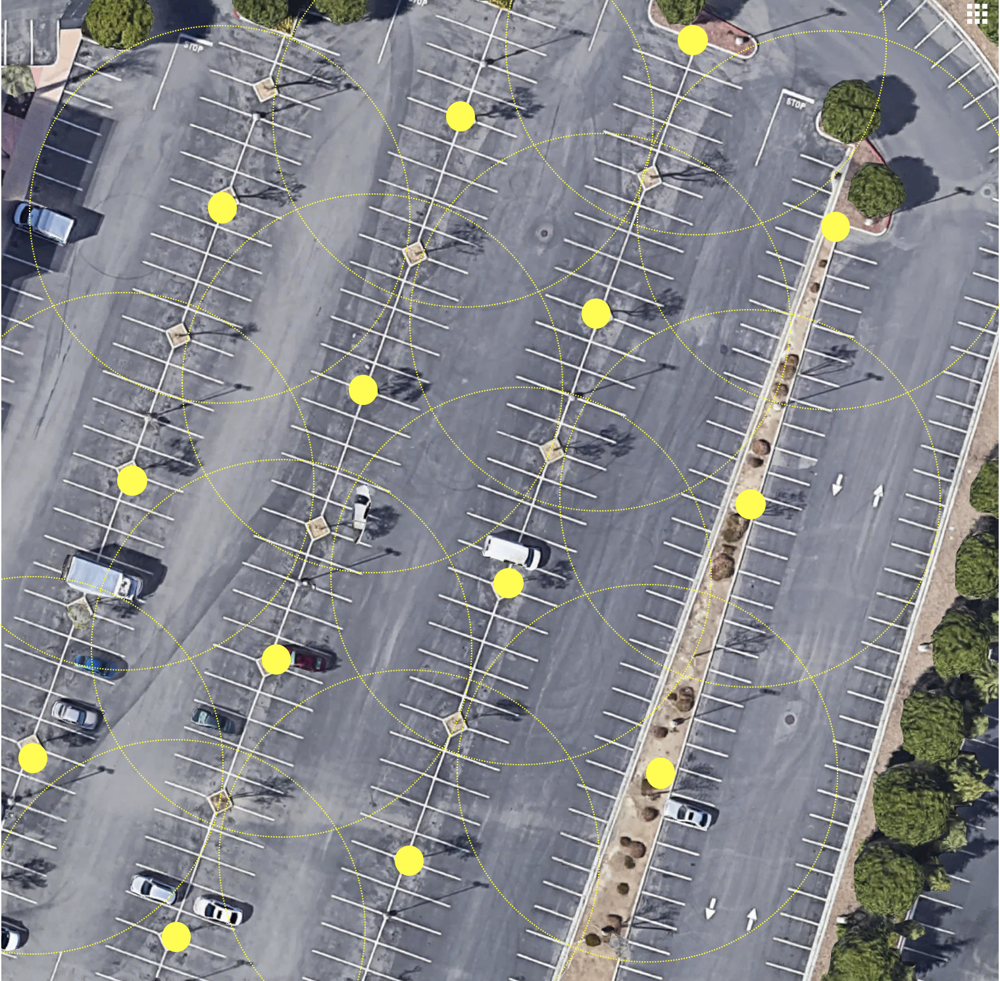
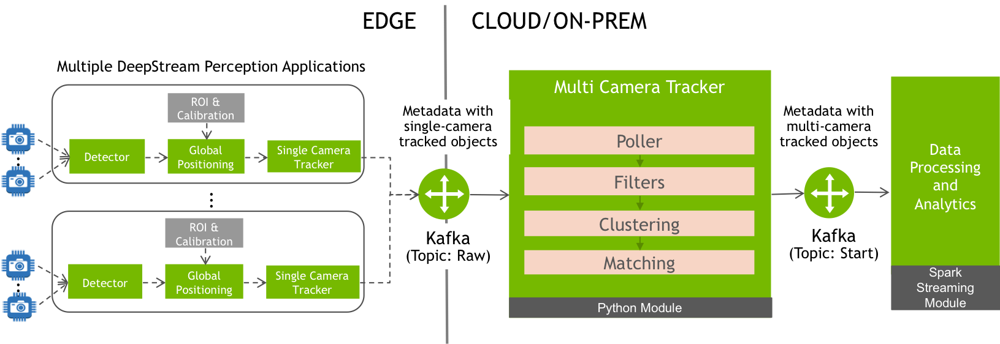

# Multi-camera Streaming Tracker

# Table of contents
1. [Introduction](#introduction)
2. [System Overview](#system-overview)
3. [Configuration](#configuration)
4. [Running Tracker](#running-tracker)

# Introduction

In a multi-camera system, objects move from fields-of-view (FoV) of different cameras. For example, in our garage setting, we have around 150 cameras – each camera covering a few 10s of meters of aisle. A car will invariably pass through multiple camera’s FoV as it passes through the garage. Such is the case in many other usecases involving multiple cameras such as traffic monitoring in an intersection/freeway and people movement in an airport.

<figure><figcaption>Example Parking Location: Yellow dots signify the cameras and dotted circles are approxiate camera coverage</figcaption></figure>

In a multicamera system, it is vital to monitor and track objects across all cameras instead of a single-camera tracking. Single-camera tracking of an object in a multi-camera system often leads to many ill-effects. Some of the prominent disadvantages of not employing multi-camera tracking are:
* _Identity splits_: A single car moving across multiple cameras is considered as different cars
* _Multiple-counting_: If the use-case is counting cars/people, they may be counted multiple times as they appear in different cameras.
* _Broken paths_: The travel paths may be limited to what one camera sees, and hence a single entire path across the observation region cannot be obtained by single-camera tracking.

Multicamera tracking can also be broadly classified into two categories based on real-time capabilities to track:
* _Batch trackers_: Here, a tracker will accumulate data over large periods of time and provides tracked identities in one-shot. The periods of time may vary based on the usecase; usually they may range from a few seconds to few days. Such trackers can be more accurate since they can aggregate paths for longer duration of time and decide on identities. However, such trackers may not be suitable in real-time or online systems where objects have to be identified within a few milliseconds.
* _Streaming trackers_: Streaming trackers provide the ability to track objects in real-time. Such trackers are employed when real-time tracking is necessary, but accuracy can be compromised for the sake of realtimeness. Deepstream, being a real-time inference platform, provides a streaming tracker. The accuracy of streaming trackers is low because of two main reasons:
  1. The data for the near-complete path of an object over larger time is unavailable since the algorithms cannot go-forward in time and peek at object’s future location; and
  2. Most algorithms make instant decision on tracked object identification, and cannot go-back in time to correct the identities of tracked objects

We describe DeepStream’s multi-camera tracker that enables users to track multiple objects that are covered by possibly multiple cameras in streaming environment.

# System Overview
<figure><figcaption>System overview of Multi-camera tracker</figcaption></figure>
The above figure shows the high-level system diagram for the multi-camera tracker system and illustration. There are two main components that interact with multi-camera tracker: the upstream “Deepstream Perception Applications” and the downstream “Data-processing and Analytics” engine. We next explain the interaction and overview of the system.

Deepstream Perception Applications are the upstream components (explained in detail in _Perception Engine_ documentation) is responsible for sending the data to Multi-Camera Tracker. In summary, the camera streams are processed in this component and the meta-data is infused with global coordinates of the detected objects. This metadata is sent over Kafka on a given topic (say, on topic “Raw”). The global coordinates are computed based on the calibration data provided to the Perception Engine. Note that we enable tracking from multiple deepstream perception applications that may be running on different edge servers. All these applications may send the data to the same kafka topic, and multi-cam tracker will consider tracking collectively across all cameras spread over multiple perception applications.

The multi-camera tracking application is a custom Python processes the input from the Kafka stream, tracks multiple objects across multiple cameras, and then emits the metadata by updating the unified ID that is assigned to each object by the tracker. In order to do so, multi-camera object tracking relies on different modules, which we describe below.

## Poller
The multi-camera system constantly polls Kafka at specified intervals to collate all the data that is received in the given period. Usually the polling interval matches the frame rate or a small multiple of a frame-rate. For example, our 360-degree usecase has a video with 2 frames per second (fps), and hence we set the polling interval to 0.5 seconds. All the data received within the given period is sorted by timestamp in the metadata. It is then passed to the next module

## Filters
In multi-camera systems, there is often a practical need to ignore certain region of interests since the objects in such regions may not be interest. Another technical need is to ignore certain areas because the number of false-positives (false detections where a car is detected even when there is no real car) may be very high in certain region. Multi-camera tracker allows specifying such polygon filters to ignore. The developers can specify the regions to be ignored. The regions to ignore is specified as set of convex polygons. The developers can then specify a list of such ignore polygons for each camera. The system ignores the detections from a given camera if the point happens to lie in any of the given ignore polygons. It passes the unignored detections to the next phase.

## Clustering
The second module will collate all the points received in the given time-period. A given object may be detected by multiple cameras at the same time. Clustering is the process where we group detections of the possibly same car into one cluster. Clustering is challenging in multicamera environment – especially in real-time – since we have to consider multiple scenarios. We describe the two main processes of clustering scheme we employ: Per-camera clustering, and inter-camera clustering

In a realistic system, it is highly possible that the time-stamps assigned to the object do not follow a strict periodicity. While the videos can usually configure to run on constant frame rate, the downstream applications may assign timestamps to the frames that may be slightly different. Hence, the multi-cam tracker has to be prone to such small noises in timestamps. We hence first aggregate detections from multiple frames of the same camera that arrive within the polling interval (0.5 second in our above example). For each camera, we consolidate single detection in the polling interval. If the two objects have the same single-camera tracker IDs (and is sensed by the same camera), we pick the most recent detection and filter-out the rest of the detections.

Inter-Camera Clustering is the main clustering algorithm that identifies the possible same objects detected by multiple applications. Clustering is achieved by first creating a distance matrix between all the points detected in the given time-slot, and then by using hierarchical agglomerative clustering. Measuring the distance is unfortunately not as simple as creating measuring a Euclidian distance (or other sort of spatial distance) between each point. We now explain the rules to specify the distance between two detections based on several observed constraints:
* Spatio-temporal distance: The first criteria to choose two detected objects as possible same is based on spatial distance. If there are two detections from two cameras different cameras that are very close-by, then it is highly possible that they are detections of the same object. Hence, by default we assign the distance between the two points i and j (d[i,j]) as the spatial distance between i and j. While this is a good heuristic, note that many other criteria have to be considered before making the final judgement; we explain this in the next few points.

* Respect single-camera tracker ids: If the same camera has assigned the different IDs to two objects in the same time-slot, then they are possibly different objects. Even if two objects are spatially close, we should not consider them to be in the same cluster. Hence, if two points i and j have different single-camera tracker ids, then we set the distance d[i,j] to infinity (or a very large number)

* Maintaining multi-cam tracker id over time: Consider a scenario where a car was detected by camera “X” and “Y” at time (t-1). Also, let X_1 and Y_1, T_1 be the id assigned by single-camera trackers of X, Y and by the multi-cam tracker, respectively, at time (t-1). In the next time-slot “t”. If we get a point detected by camera “Y” with single camera id “Y_1” and another point with single camera id “X_1” (detected by camera ”X”), then we should assign both these points the same multi-cam tracker ID “T_1”, i.e. both these points have to be assigned to the same cluster irrespective of spatial distance between them. Note that it is possible that the single-camera tracker has error an accidentally assigns the same id to two different objects. However, we do not handle such cases in this version of multi-cam tracking.

    In order to assign previously chosen IDs, we maintain a list of single-camera tracker ids (and corresponding camera id) that is assigned to each multi-camera tracker id. If two detections (points i and j) from different cameras has been issued the same multi-camera tracking id, we then set the distance d[i,j] = 0

* Overlapping and Conflicting Cameras:
    In multiple usecases, it is required to combine detections only from a few cameras. The vice-versa requirement is also very common; it is often needed not to consider detections from two conflicting cameras as a single object. Consider a usecase where a camera might be monitoring two neighboring of the aisles of a parking lot or cameras monitoring different direction of movement on the same road. The objects monitored by the cameras may be spatially very close. Hence, by the first rule above, we may cluster these two points as single object. However, these two are most often different objects. Hence, multi-camera tracker provides optional configuration items on overlapping or conflicting cameras where we can specify a list of overlapping and conflicting cameras for each camera.

    If two object detections in the same time-slot (say, point i and j) from two different cameras “X” and “Y”, they are assigned a distance of infinity if they belong to conflicting cameras (or do not belong to the set of overlapping cameras). Note that if the overlapping and conflicting cameras are not included for any of the two cameras, then this step is skipped, and the d[i,j] is unchanged.


We have a complete distance matrix based on the above rules. However, note that resulting distance function constructed from above is a heuristic, and may not be a formal mathematical metric. We use hierarchical agglomerative clustering with “complete linkage method”; this ensures that as we cluster hierarchically, we take the maximum distance between the leaves to create distances between the cluster. This will enable not combining two points where we have specified the distance as infinity (because of the rules 2 and 4 above). We then cut the resulting dendrogram at a specified distance threshold (that is specified in the config file by the key “CLUSTER_DIST_THRESH_IN_M”)


Among the resulting clusters, we pick one element as representative element from the cluster. Note that we also update the list of ids that are clustered together at time t


## Matching


This step finally assigns the id to the possibly similar object found by the above clustering method at time-slot t, by comparing how much the representatives have moved from time (t-1) to time (t).


Recall that, at every time-slot, we cluster and pick a cluster representative. Also, the matching step at time-slot (t-1) would have assigned a multi-cam tracker id to the cluster representatives at time (t-1). Hence there is already multi-camera tracking id issued to objects detected at (t-1). We now compare the representatives at time-slot (t-1) to time-slot (t), and percolate the id issued to the (t-1) objects to the best matching representatives at time-slot (t).


This problem decomposes to the problem of minimum cost bipartite matching problem, where one partition of points (representatives at time-slot (t-1)) are matched one-to-one with aother partition of points (representatives at time-slot t). This can be usually solved in polynomial time by algorithms such as [Hungarian Assignment Algorithm](https://en.wikipedia.org/wiki/Hungarian_algorithm)


Note that there are two borderline cases that need to be handled:

If the matching distance is too large, then we should void the match. For example, if the spatial distance between the matched representatives A and B is, say, 100 m, then they should not be matched; this is practical in our garage usecase since an object possibly cannot travel at the speed of 226 miles per hour. Note that this threshold is use-case dependent, and can be configured by providing a judicious value in the key “MATCH_MAX_DIST_IN_M”. Any matching that is greater than this threshold is considered as unmatched

Unmatched points: The points at time (t-1) and (t) may be unmatched because of two reasons: the number of points in the two partitions are different or because of the above rule. In either case, if a point is unmatched in partition corresponding to time-slot t, we then consider that detection as new detection, and issue a new id. Note that this might be due to car entering for the first time in a garage (in our 360-degree application). Also note that we are ignoring the points that are unmatched in partition corresponding to the time-slot (t-1). These may represent the cars that exited the garage.


We then transmit all the repreentative points for time-slot (t) to the downstrream kakfa topic (e.g., topic “start”).


# Configuration
The multicamera tracker takes in two config files:
1. *Stream Config file:* This file describes the config needed for input/output of tracker. Example stream config

    ```json
    {
        "profileTime": false,
        "msgBrokerConfig": {
            "inputKafkaServerUrl": "kafka:9092",
            "inputKafkaTopic": "metromind-raw",
            "outputKafkaServerUrl": "kafka:9092",
            "outputKafkaTopic": "metromind-start"
        }
    }
    ```
2. *Tracker Config file:* This file describes the configuration parameters for the tracker. The config file has the following elements
    1. `overlappig_camera_ids`: This key specifies the cameras which have overlapping coverages. If this dictionary has non-zero number of keys, then the tracker will only merge detections from the overlapping cameras. It will not merge between the cameras that do not overlap; it will always be kept separate
    2. `conflict_cameras_adj_list`: This key specifies the cameras whose detections shoult NOT be merged together. For example, there two objects detected from two neighboring cameras that monitor entry and exit lanes are closeby in space. However, since this lane is divided, we would not want the detections from both cameras to be merged even though their detections are closeby.
    3. `MAP_INFO`: This key specifies the road-network information. The road-network graph is represented as a set of lines. Each line has a set of points [set of (lon, lat)]. This map will be used to snap detected points to the road network if the option if SNAP_POINTS_TO_GRAPH is True.
    4. `IGNORE_DETECTION_DICT_MOVING`: This dictionary value indicates the polygons inside which detections has to be ignored (not processed). For each camera, we can specify a list of polygons where detections have to be ignored. Often there are regions (ROIs) where the detections should be ignored. The reason for ignoring may be since the user has defined only specific ROI to ignore, or also may be because the detections in those regions are prone to high false-detections (e.g., due to frequent lighting changes)

# Running tracker
We assume that `tracker_dir` corresponds to the directory cloned from git (e.g. `/home/user/git/tracker`).

Run the following commands:

```bash
<machine>$ export PYTHONPATH="<tracker_dir>/code"
<machine>$ python3 usecasecode/360d/stream_track.py --sconfig=`<path to stream config file>` --config=`<path to tracker config file>'
Starting MC-Streaming app with following args:
consumer kafka server=<consumer kafka bootstrap url>
consumer kafka topic=<consumer topic>
producer kafka server=<producer kafka bootstrap url>
producer kafka topic=<producer topic>
Time profile=<True or False based on time profiling is enabled on stream config file>
MC Tracker Config File=<stream config file>
...
```

For further details please refer to

https://gitlab-master.nvidia.com/metromind/DS-360-app/track